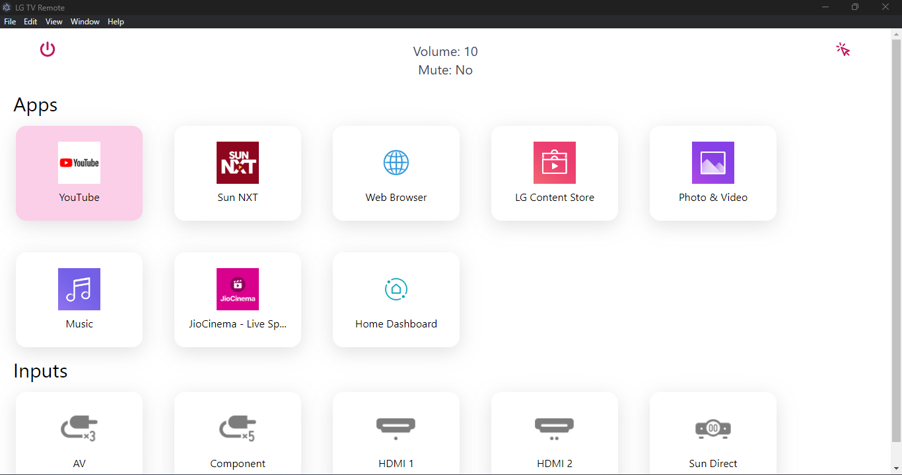

# LG WebOS TV Controller

Welcome to the LG WebOS TV Controller repository! This Electron-based desktop application allows you to control your LG WebOS TVs seamlessly. Whether you want to launch apps, switch inputs, control volume/mute, navigate with arrow keys, or launch the home screen, this app has you covered.

## Features

- **Launch Apps:** Easily launch your favorite apps on your LG WebOS TV with just a click.

- **Switch Inputs:** Switch between different inputs on your TV effortlessly using the desktop app.

- **Control Volume/Mute:** Adjust the volume or mute your TV directly from the application.

- **Navigate and type with your PC:** Use your computer's keyboard and mouse for smooth navigation on your LG WebOS TV.

- **Launch Home:** Return to the home screen of your TV conveniently.

## Screenshot




## Known Issues

- **Disconnected Status not Displayed:** The application currently does not show a disconnected status when the TV gets disconnected. This is a known issue. Please raise a pull request if you have a fix for this.

## How to Use

1. Clone the repository to your local machine.

   ```
   git clone https://github.com/PragadeshBS/lg-tv-remote
   ```

2. Install dependencies.

   ```
   npm install && cd new-view && npm install && npm run build
   ```

3. Run the application.

   ```
   npm start
   ```

4. Enjoy controlling your LG WebOS TV from your desktop!

## Contributing

If you encounter any issues or have suggestions for improvement, feel free to create an issue or submit a pull request.
